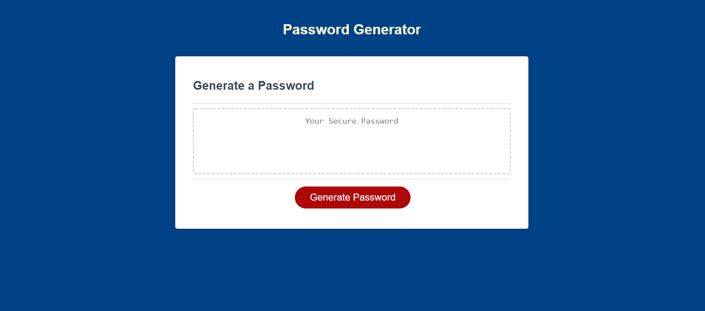

# Password Generator

## Purpose of the Password Generator

This password generator is designed for employees who have access to sensitive data. This generator will randomly generate a password between 8 and 128 characters, and consists of 1 to 4 different character types, depending on user preference. This allows employees to create strong passwords that provide greater security.

## Deployed Link

Live link:  https://aumcintyre.github.io/Password-Generator/

Repo link: https://github.com/aumcintyre/Password-Generator/

## Screenshot

## My Experience

My experience with this went pretty smoothly after I went back and redid all of the activites from week 3. I was able to get mostly everything to work without too much difficulty. I did run into an issue where I was calling and declaring a function at the same time, and it was causing my prompts to open when the page rendered, rather than the page waiting for me to click the button. I feel like I've got a decent grasp of JS basics, but I still want to practice these topics a bit more. 

## Credit

### Images
<ul>
<li>Personal Screenshot</li>
</ul>

### Coding Help
<ul>
<li>YouTube</li>
<li>Mozilla</li>
<li>Stack Overflow</li>
</ul>
